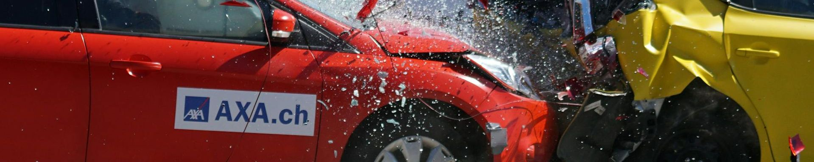
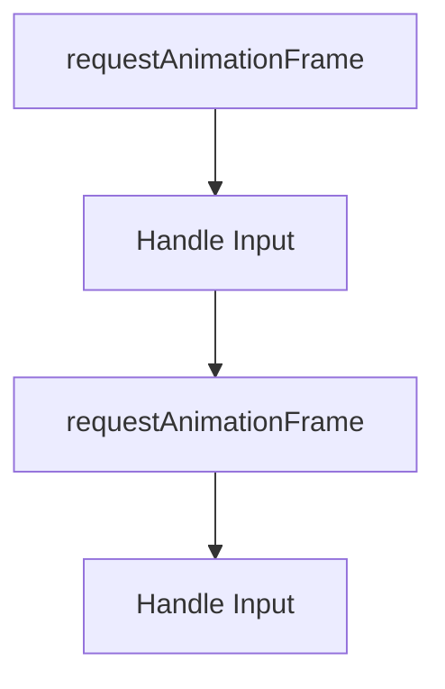
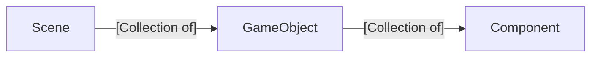

# Fall2025.Topics
These are the topics we are going to cover in class each day. Links to [example student videos ](https://www.youtube.com/playlist?list=PLH9qo0GKu2iSlchbSeksN18S87gMIjHOg) and [slides from class](https://uofnebraska-my.sharepoint.com/:f:/g/personal/17816140_nebraska_edu/EktuKJi3m_9Khf6sZLG_lrkBc46ZoPAOI6gCk86_xmf0sQ?e=sRqveC)

  
---
---

https://www.youtube.com/watch?v=jMwksWSsfW4

# Day 11 - October 1 - RigidBody and  Collision Resolution (🧑‍🏫Lecture)

## 💡New Idea: Collision Detection Implementation
- Previously we implemented the separate axis theorem
- Update the game engine so it checks for collisions as part of the game loop
- When there is an overlap, call `onCollisionEnter` for both game objects

## 👩‍💻Activity: Add Collision Detection to our Space Shooter
- Add `onCollisionEnter` to our enemy ships
- Check to see if the colliding object is a laser

## 💡New Idea: Physics
- Newton's three laws of motion can be added to our game engine with:
  - A RigidBody component (laws 1 and 2: inertia and forces)
  - Collision Resolution (law 3: equal and opposite reaction)

## 💡New Idea: RigidBody
- The RigidBody component is a special component that tracks a game object's velocity and acceleration
- We use this component to also track gravity
- Every update, acceleration updates velocity
- Every update, velocity updates position

## 👩‍💻Activity: Code a falling game object with gravity
- Add a RigidBody component to a game object 
- Set gravity
- Watch the simulation

## 💡New Idea: Collision Resolution
- When two game objects overlap, we should move them following Newton's third law
- The separate axis theorem can help us find the minimum transform vector (MTV)
- We find the axis with the lowest overlap. 
  - This axis shows us the direction and distance we need to move to resolve a collision

## 👩‍💻Activity: Add Collision Resolution to a Platformer Game
- By adding collision resolution to a platformer, our character no longer falls through platforms
- By checking the objects we are in collision with, we can determine if we can jump.

## [🏁Final Code](https://github.com/cs2510/Fall2025.Day11.Gravity)
  
---
---

# Day 10 - September 29 - 👟Sprint
  
---
---

# Day 09 - September 24 - Collisions  (🧑‍🏫Lecture)

## ~~📢Announcements~~n

## 🔙Review
- Fix `start` code from before
- Reminder to only use the `Polygon` component, not rectangles or circles

## 💡New Idea: Orthogonal Vectors
- Two vectors are orthogonal if their dot product is 0. 
- This is the same as having a 90 degree angle between them
- In 2D, the vector (x,y) is orthogonal to (-y, x) and (y, -x)
- 
## 💡New Idea: Collider Components
- We use collider components to identify which game objects need to have collision detection done
- In this course the collider component is empty
- In commerical game engines, a collider may provide a simplified version of a polygon to speed up collisions

## 👩‍💻Activity: Code the Separate Axis Theorem
- Are there any games that don't have any collisions?
  - Word games like hangman or Wordle
  - Text-based adventures
- Almost all games do, especially if there any any buttons to push anywhere.

## 💡New Idea: Separate Axis Theorem
- Two convert polygons are not in collision if you can draw a straight line (axis) between them
- If there is a line where the projections of the two polygons don't overlap, then the are not in collision
- We only need to check a finite number of lines:
  - The lines who tangents are orthogonal to each pair of points in the polygons
- This algorithm does not work for concave polygons

## 👩‍💻Activity: Code the Separate Axis Theorem

## 🧭Ideas to explore on your own
- How could we use the separate axis theorem on concave objects?
- How could we speed up the separate axis theorem?

## 🏁Final Code
 - [The final code for today](https://github.com/cs2510/Fall2025.Day09.Collisions)
  
---
---

# Day 07 - September 22 - 👟Sprint
  
---
---

# Day 07 - September 17 - Collisions Prep (🧑‍🏫Lecture)

## ~~📢Announcements~~

## 🔙Review
- Think about a scene made out of Lego bricks
  - What is similar to a component? (The individual Lego bricks)
  - What is similar to a scene? (The placement of the individual models.)
  - What is similar to a game object? (The models made out of individual components.)

| Scene| Game Object | Components|
|---|---|---|
| A collection of game objects with their position and rotation | A collection of components with a scale| The fundamental game-specific code|
| Everything defined in the constructor | Everything defined in the constructor| Nothing in the constructor, use `start`, `update`, and `draw`.|

## 💡New Idea: Defining Polygons with Points
- We don't want to have to create a new component each time we want a polygon of a different shape. If we add a `points` variable to our `Polygon` component, we can loop over those points when we draw. We can also update the points in the `Polygon` in the constructor of a game object, customizing it for each game object.

## 👩‍💻Activity: Using `Polygon` for different shapes
- Take our space shooter game and change the shape of the objects while using the same `Polygon` component.

## 💡New Idea: Vector Multiplication

$$ v\ times\ s = (v_{x}*s, v_{y}*s)$$
$$ v_1\ scale\ v_2=(v_{1x}*v_{2x}, v_{1y}*v_{2y})$$
$$ v_1\ dot\ v_2=v_{1x}*v_{2x}+v_{1y}*v_{2y}$$

- We use `times` when we want to scale a vector by a single number (a scalar). For example, if I want to make a polygon twice as large in all directions, I would multiply each point in the polygon by one number using `times`
- We use `scale` when we want to scale a vector by another, non-uniform vector. For example,  if I want to make a square a rectangle, I would multiple each point in the square by a non-uniform vector using `scale`. The `scale` function is similar to the mathematical idea of component-wise multiplication.
- We use `dot` when we need to find the similarity between two vectors or project one vector onto another vector. For example, if I want to know if the heading of an enemy is nearly the same direction as the heading toward the player, I would multiple those two vectors using `dot`. As another example, if I want to project vector 1 on vector 2, I would multiple those two vectors using `dot`.
  - When two vectors have an identical heading, their dot product is 1. If there are orthogonal, their dot product is 0. If they are pointing in opposite directions, then the dot product will be -1.
  - Additional information can be found here: https://en.wikipedia.org/wiki/Dot_product

## 👩‍💻Activity: Multiply the movement of objects by a speed
- Use `times` to make objects move further or shorter every frame.
- Use a boolean value to let a space ship fire on alternating sides.

  

## 💡New Idea: Removing game objects
- Destroy a game object by marking it for delete
- We don't immediately destroy game objects to prevent race conditions
   - 🛝See slides on Deleting Objects

## 👩‍💻Activity: Remove lasers when they are off screen
- To prevent the game from overloading, we can remove lasers when they are off the screen.

## 💡New Idea: Setting up frame-rate independent behavior
- Anytime we move anything, we should multiply by `Time.deltaTime`. If `Time.deltaTime` is updated based on the time between frames, then the behavior of the game should be independent of the speed of the machine.

## 👩‍💻Activity: Multiply all movement by `Time.deltaTime`
- This allows us to define all motion in terms of pixels/second.
- When we add a camera, we can move to feet/second or meters/second.

## 💡New Idea: Named Game Objects
- In order to find game objects in a scene, we give each game object a name.
  - [To see more about how `name` is used in Unity, you can review the documentation here](https://docs.unity3d.com/6000.2/Documentation/ScriptReference/Object-name.html)

## 🏁Final Code
 - [The final code for today](https://github.com/CS2510/Fall2025.Day07.CollisionsPrep)
  
---
---

# Day 06, September 15 - Engine Class, Instantiate (👟Sprint)

## 🔙Review
- Time outside of class means times in front of the keyboard coding
- Working inside another engine does not count toward this class

## 👩‍💻Activity:
- Move the code in our html file into a new Engine class
- Call instantiate to create new game objects as needed
  - 🛝See slides on Starting Objects

## 🏁Final Code
 - [The final code for today](https://github.com/CS2510/Fall2025.Day06.EngineClass)
  
---
---

# Day 05, September 10 - Transforms (🧑‍🏫Lecture)

## 📢Announcements
- Upcoming sprint
  - Study an existing game (write down what you learn)
  - Follow a JS tutorial
  - Start working on your own game
  
## 👩‍💻Activity: Talk about what you are doing/will do during your sprint
- If you don't know, talk to the professor

## 🔙Review
- Fix movement bug from Day 04 (use getters in Vector2)
  - 🔗Additional information available at https://developer.mozilla.org/en-US/docs/Web/JavaScript/Reference/Functions/get and https://www.w3schools.com/js/js_object_accessors.asp

## 💡New Idea: Components track their parent game object
- When we add components to a game object, we need to track which game object is their parent
- Components have a `gameObject` field
  - 🔗Additional information available at https://docs.unity3d.com/6000.2/Documentation/ScriptReference/Component-gameObject.html
- Game objects add components through a `addComponent` function
- We pass a reference to a component's class instead of using an new instance of the class

## 💡New Idea: Transforms
- All game objects have a position, rotation, and scale
  - 🔗Additional information available at https://docs.unity3d.com/6000.2/Documentation/ScriptReference/Transform.html
- Add a transform component in the game object constructor
- Use getters to easily access the transform from components
  - 🔗Additional information available at https://docs.unity3d.com/6000.2/Documentation/ScriptReference/Component-transform.html
- Use the transform when rendering

## 💡New Idea: Instantiate in scenes
- We set the position and rotation of game objects in scenes
- We add game objects using a custom `instantiate` function
- We don't set the transform in a component's `start`

## 💡New Idea: Draw Polygons in an Engine-Level Component
- So many game objects need to be drawn, we don't need to keep repeating drawing code
- Add a new `Polygon` component to the engine folder
- This component draws based on the transform (including scale) and a set of points

## 💡New Idea: Set values in `addComponent`
- We want to set custom values on components in game objects
- This supports reusability
- We will use JS's `Object.assign` function
  - 🔗Additional information available at https://developer.mozilla.org/en-US/docs/Web/JavaScript/Reference/Global_Objects/Object/assign and https://www.w3schools.com/jsref/jsref_object_assign.asp

## 👩‍💻Activity: Reusing components
- Watch a game
- Think about which components can be reused among the game objects.

## 🤔To Think About
- What scenes, game objects, and components will you need in your game?

## 🏁Final Code
- [The final code from Day05](https://github.com/CS2510/Fall2025.Day05.Transforms)

  
---
---

# Day 04, September 8 - Keyboard Input (🧑‍🏫Lecture)

## 📢Announcements
- First self-assessment/quiz in 7 days
- We will be "on the clock" this week.
- Copy v transcribe (review AI)

## 🔙Review
- What is a Scene v Game Object v Component

## 👩‍💻Activity: Code on your own -> Add a new game object
- Add an additional triangle to the Day 03 code using Game Objects and Components
- 🔗[Detailed instructions here](https://github.com/CS2510/Fall2025.Day04.Input/blob/main/TODO.md)

## 💡New Idea: Keyboard Input
- How is input handled by the computer?

- How can we capture keyboard changes?
- 🛝See slides on Input

## 👩‍💻Activity: Keyboard Input
- Move a game object on the screen based on keyboard input
- See final code

## 🤔To Think About
- Why do many games use a combination of inputs, e.g. mouse and keyboard instead of just keyboard or mouse?

## 🏁Final Code
- [The final code from Day04](https://github.com/CS2510/Fall2025.Day04.Input)

  
---
---

# Day 03, September 3 - Standard Architecture for Games (🧑‍🏫Lecture)

## 📢Announcements
- None

## 🔙Review
- What is a game loop?
- What is a vector?

## 💡New Idea: Engine-specific v Game Specific
- Look at a game. For example, look at a classic [Nintendo game](https://www.retrogames.cz/play_004-Atari2600.php)
  - What parts of the game would be in all or most games? These would be engine-specific
  - What parts of the game are very specific to this game? These would be game-specific
- By separating our code into engine-specific and game-specific code, we start to create an engine. This makes it easier to create games and prepares us to use a commerical game engine.  

## 👩‍💻Activity
- Go through the Day03 code and label the code as being engine-specific or game-specific

## 💡New Idea: Three main functions of "things" in a game
  - Start
  - Update
  - Draw

## 💡New Idea: Main Game Architectural Hierarchy
- Scenes (also levels or stages)
  - A scene is a collection of game objects
- Game Objects (also actors or pawns or entities)
  - A game object is a collection of components
- Components (also scripts)

## 👩‍💻Activity
- Create the files for engine-specific classes
  - Scene
  - GameObject
  - Component
- Add the start, update, and draw functions to each engine-specific class

## 👩‍💻Activity
- Create the files for game-specific classes
  - MainScene
  - TriangleGameObject
  - TriangleController
- Add the constructor, start, update, and draw functions to each game-specific class
- Rewrite the code so that the html code uses these new classes (see Final code section below).

## 🤔To Think About
- Can you add a second kind triangle that has a random velocity and is colored red using this architecture?

## 🏁Final Code
- This is the link for [the final code we generated on Day03](https://github.com/CS2510/Fall2025.Day03.GameEngine)
- 🔗You can see two other example games using the same architecture in the [other games Day03 repository](https://github.com/CS2510/Fall2025.Day03.OtherExamples)

  
---
---

# Day 02, August 27 - Game Loop (🧑‍🏫Lecture)
## 📢Announcements
- No class on Monday due to Labor Day

## 🔙Review
- What is the difference between the Box Model, SVG, and Canvas?
- What is the difference between the JS keyword `let` and `const`?

## Syllabus

## 💡New Idea: What is a computer game?
- In this class, a game is an enjoyable, interactive, visual simulation.
- How are we going to learn game programming?
  - Learn the math
  - Learn the architecture
  - Practice

## 💡New Idea: Repeated rendering (Visual)
- requestAnimationFrame
  - 🔗Additional information at https://developer.mozilla.org/en-US/docs/Web/API/Window/requestAnimationFrame, https://www.w3schools.com/jsref/met_win_requestanimationframe.asp

## 💡New Idea: Updating our game (Interactive)
- MVC (Architecture)
- gameLoop formalization (Architecture)
  - 🔗Additional information at https://m-abdullah-ramees0916.medium.com/the-game-loop-f6f5cb68c00, 

## 💡New Idea: Vectors (Math)
- What is a vector
  - 🔗Additional information at https://en.wikipedia.org/wiki/Vector_(mathematics_and_physics)
- Adding Vectors
  - 🔗Additional information at https://mathworld.wolfram.com/VectorAddition.html

## 💡New Idea: Physics (Math/Simulation)
- Velocity
  - 🔗Additional information https://en.wikipedia.org/wiki/Velocity

## 💡New Idea: Classes in JS
- classes in JS
  - 🔗Additional information at https://developer.mozilla.org/en-US/docs/Web/JavaScript/Reference/Classes, https://www.w3schools.com/js/js_classes.asp
- constructors in JS
  - 🔗Additional information at https://developer.mozilla.org/en-US/docs/Web/JavaScript/Reference/Classes/constructor, https://www.w3schools.com/jsref/jsref_constructor_class.asp
- class functions in JS
- field in JS
  - 🔗Additional information at https://developer.mozilla.org/en-US/docs/Web/JavaScript/Reference/Classes/Public_class_fields

## 👩‍💻Activity
- Create a simple bouncing triangle simulation using a new Vector2 class. (See Final Code section.)

## 🤔To Think About
- Why is creative mode in Minecraft considered a game while a painting app is not?

## 🏁Final Code
- Combining classes, vectors, and our original code, we arrive at our [Day 02 Code](https://github.com/CS2510/Fall2025.Day02.GameLoop).

## Ideas to explore on your own
- Can you change the code to make all the vertices of the triangle to have their own independent velocity?
  - Can you make the above change using arrays so that you don't need new variables for each vertex?

  
---
---

# Day 01, August 25th - Introduction (🧑‍🏫Lecture)

## 📢Announcements
- Welcome to class

## 🔙Review
- None
  
## 💡New Idea: Macro view of methods of drawing 

- Box Model
    - 
    - 🔗Addition information at https://www.w3schools.com/css/css_boxmodel.asp, https://developer.mozilla.org/en-US/docs/Learn_web_development/Core/Styling_basics/Box_model
- SVG
    - 🔗Additional information at https://developer.mozilla.org/en-US/docs/Web/SVG/Guides/SVG_in_HTML, https://www.w3schools.com/graphics/svg_intro.asp
- Canvas
    - 🔗Additional information at https://www.w3schools.com/html/html5_canvas.asp, https://developer.mozilla.org/en-US/docs/Web/API/Canvas_API

## What we won't be doing in class
- Images (Including emoji)
- Sounds

## 💡New Idea: New JS concepts

- Structure of an HTML document
  - doctype
  - html
  - head
  - body
  - script
  - Example code at https://github.com/CS2510/Fall2025.Day01.Introduction/blob/main/00_html_structure.html
  - 🔗Additional information at https://www.w3schools.com/html/html_intro.asp

- Access elements in JS
  - 🔗Additional information at https://www.w3schools.com/jsref/met_document_queryselector.asp

- Declaring variables in JS
  - let and const
  - Example code in [this file](./JS.html)
  - 🔗Additional information at https://www.geeksforgeeks.org/javascript/difference-between-var-let-and-const-keywords-in-javascript/

- Good Introductionary Websites in JS
  - w3schools JS tutorials at https://www.w3schools.com/js/
  - GeeksforGeeks JS tutorials at https://www.geeksforgeeks.org/javascript/javascript-tutorial/

## 💡New Idea: Methods of drawing specific to canvas
- Showing color
  - See slides: 3 Ways to show Color
  - 🔗Additional information about named colors at https://www.w3schools.com/html/html_colors.asp
  - 🔗Additional information about rgb and hexadecimal values at https://htmlcolorcodes.com/color-picker/
- Paths
  - 🔗Additional information at https://www.w3resource.com/html5-canvas/html5-canvas-path.php
- Polygons
- Rectangles
- Arcs
    - Introduction to radians
- Text
  - See slides: Fonts
  - 🔗Additional information at https://developer.mozilla.org/en-US/docs/Web/API/Canvas_API/Tutorial/Drawing_text, https://www.w3schools.com/graphics/canvas_text.asp
- Example code at https://github.com/CS2510/Fall2025.Day01.Introduction/blob/main/01_basic_drawing.html

## 👩‍💻Activity
- Take what we have learned about drawing and draw something more advanced.
- 
- [Batman Logos](https://flowingdata.com/2012/12/24/evolution-of-batman-logo-1940-2012/)

## 🤔To Think About
- Block out a game you enjoy using the basic drawing tools we use in class

## 🏁Final Code
- Example code at https://github.com/CS2510/Fall2025.Day01.Introduction/blob/main/02_blocking_a_game.html, https://github.com/CS2510/Fall2025.Day01.Introduction/blob/main/03_blocking_a_game_2.html

