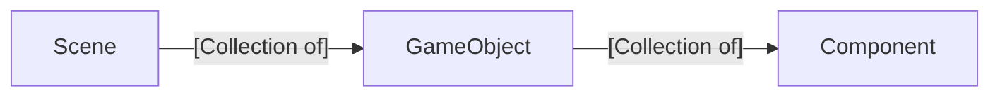

# Fall2025.Topics
These are the topics we are going to cover in class each day. Links to [example student videos ](https://www.youtube.com/playlist?list=PLH9qo0GKu2iSlchbSeksN18S87gMIjHOg) and [slides from class](https://uofnebraska-my.sharepoint.com/:f:/g/personal/17816140_nebraska_edu/EktuKJi3m_9Khf6sZLG_lrkBc46ZoPAOI6gCk86_xmf0sQ?e=sRqveC)

# Day 04, September 8 (Lecture)

## 📢Announcements
- First self-assessment/quiz in 7 days
- We will be "on the clock" this week.
- Copy v transcribe (review AI)

## 🔙Review
- What is a Scene v Game Object v Component

## Activity
- Add an additional triangle to the Day 03 code using Game Objects and Components

## New Idea: Keyboard Input
- How is input handled by the computer
- How can we capture keyboard changes

## Activity: Keyboard Input
- How can we move a game object based on the keyboard

## New Idea: Mouse Input
- How is mouse input handled by the computer
- How can we capture mouse input?

## Activity: Mouse Input
- Move a game object using the mouse.

## 💡New Idea: Key Ideas Table
|                                               | Scene        | Game Object | Component |
| --------------------------------------------- | ------------ | ----------- | --------- |
| Children                                      | Game Objects | Components  | N/A       |
| Sub Class has Game-Specific Constructor?      | Yes          | Yes         | No        |
| Sub Class has Game-Specific Start/Update/Draw | No           | No          | Yes       |

# Day 03, September 3 (Lecture)

## 📢Announcements
- None

## 🔙Review
- What is a game loop?
- What is a vector?

## 💡New Idea: Engine-specific v Game Specific
- Look at a game. For example, look at a classic [Nintendo game](https://www.retrogames.cz/play_004-Atari2600.php)
  - What parts of the game would be in all or most games? These would be engine-specific
  - What parts of the game are very specific to this game? These would be game-specific
- By separating our code into engine-specific and game-specific code, we start to create an engine. This makes it easier to create games and prepares us to use a commerical game engine.  

## 👩‍💻Activity
- Go through the Day03 code and label the code as being engine-specific or game-specific

## 💡New Idea: Three main functions of "things" in a game
  - Start
  - Update
  - Draw

## 💡New Idea: Main Game Architectural Hierarchy
- Scenes (also levels or stages)
  - A scene is a collection of game objects
- Game Objects (also actors or pawns or entities)
  - A game object is a collection of components
- Components (also scripts)

## 👩‍💻Activity
- Create the files for engine-specific classes
  - Scene
  - GameObject
  - Component
- Add the start, update, and draw functions to each engine-specific class

## 👩‍💻Activity
- Create the files for game-specific classes
  - MainScene
  - TriangleGameObject
  - TriangleController
- Add the constructor, start, update, and draw functions to each game-specific class
- Rewrite the code so that the html code uses these new classes (see Final code section below).

## 🤔To Think About
- Can you add a second kind triangle that has a random velocity and is colored red using this architecture?

## 🏁Final Code
- This is the link for [the final code we generated on Day03](https://github.com/CS2510/Fall2025.Day03.GameEngine)
- You can see two other example games using the same architecture in the [other games Day03 repository](https://github.com/CS2510/Fall2025.Day03.OtherExamples)

# Day 02, August 27 (Lecture)
## 📢Announcements
- No class on Monday due to Labor Day

## 🔙Review
- What is the difference between the Box Model, SVG, and Canvas?
- What is the difference between the JS keyword `let` and `const`?

## Syllabus

## 💡New Idea: What is a computer game?
- In this class, a game is an enjoyable, interactive, visual simulation.
- How are we going to learn game programming?
  - Learn the math
  - Learn the architecture
  - Practice

## 💡New Idea: Repeated rendering (Visual)
- requestAnimationFrame
  - Additional information at https://developer.mozilla.org/en-US/docs/Web/API/Window/requestAnimationFrame, https://www.w3schools.com/jsref/met_win_requestanimationframe.asp

## 💡New Idea: Updating our game (Interactive)
- MVC (Architecture)
- gameLoop formalization (Architecture)
  - Additional information at https://m-abdullah-ramees0916.medium.com/the-game-loop-f6f5cb68c00, 

## 💡New Idea: Vectors (Math)
- What is a vector
  - Additional information at https://en.wikipedia.org/wiki/Vector_(mathematics_and_physics)
- Adding Vectors
  - Additional information at https://mathworld.wolfram.com/VectorAddition.html

## 💡New Idea: Physics (Math/Simulation)
- Velocity
  - Additional information https://en.wikipedia.org/wiki/Velocity

## 💡New Idea: Classes in JS
- classes in JS
  - Additional information at https://developer.mozilla.org/en-US/docs/Web/JavaScript/Reference/Classes, https://www.w3schools.com/js/js_classes.asp
- constructors in JS
  - Additional information at https://developer.mozilla.org/en-US/docs/Web/JavaScript/Reference/Classes/constructor, https://www.w3schools.com/jsref/jsref_constructor_class.asp
- class functions in JS
- field in JS
  - Additional information at https://developer.mozilla.org/en-US/docs/Web/JavaScript/Reference/Classes/Public_class_fields

## 👩‍💻Activity
- Create a simple bouncing triangle simulation using a new Vector2 class. (See Final Code section.)

## 🤔To Think About
- Why is creative mode in Minecraft considered a game while a painting app is not?

## 🏁Final Code
- Combining classes, vectors, and our original code, we arrive at our [Day 02 Code](https://github.com/CS2510/Fall2025.Day02.GameLoop).

## Ideas to explore on your own
- Can you change the code to make all the vertices of the triangle to have their own independent velocity?
  - Can you make the above change using arrays so that you don't need new variables for each vertex?

# Day 01, August 25th (Lecture)

## 📢Announcements
- Welcome to class

## Review
- None
  
## 💡New Idea: Macro view of methods of drawing 

- Box Model
    - 
    - Addition information at https://www.w3schools.com/css/css_boxmodel.asp, https://developer.mozilla.org/en-US/docs/Learn_web_development/Core/Styling_basics/Box_model
- SVG
    - Additional information at https://developer.mozilla.org/en-US/docs/Web/SVG/Guides/SVG_in_HTML, https://www.w3schools.com/graphics/svg_intro.asp
- Canvas
    - Additional information at https://www.w3schools.com/html/html5_canvas.asp, https://developer.mozilla.org/en-US/docs/Web/API/Canvas_API

## What we won't be doing in class
- Images (Including emoji)
- Sounds

## 💡New Idea: New JS concepts

- Structure of an HTML document
  - doctype
  - html
  - head
  - body
  - script
  - Example code at https://github.com/CS2510/Fall2025.Day01.Introduction/blob/main/00_html_structure.html
  - Additional information at https://www.w3schools.com/html/html_intro.asp

- Access elements in JS
  - Additional information at https://www.w3schools.com/jsref/met_document_queryselector.asp

- Declaring variables in JS
  - let and const
  - Example code in [this file](./JS.html)
  - Additional information at https://www.geeksforgeeks.org/javascript/difference-between-var-let-and-const-keywords-in-javascript/

- Good Introductionary Websites in JS
  - w3schools JS tutorials at https://www.w3schools.com/js/
  - GeeksforGeeks JS tutorials at https://www.geeksforgeeks.org/javascript/javascript-tutorial/

## 💡New Idea: Methods of drawing specific to canvas
- Showing color
  - See slides: 3 Ways to show Color
  - Additional information about named colors at https://www.w3schools.com/html/html_colors.asp
  - Additional information about rgb and hexadecimal values at https://htmlcolorcodes.com/color-picker/
- Paths
  - Additional information at https://www.w3resource.com/html5-canvas/html5-canvas-path.php
- Polygons
- Rectangles
- Arcs
    - Introduction to radians
- Text
  - See slides: Fonts
  - Additional information at https://developer.mozilla.org/en-US/docs/Web/API/Canvas_API/Tutorial/Drawing_text, https://www.w3schools.com/graphics/canvas_text.asp
- Example code at https://github.com/CS2510/Fall2025.Day01.Introduction/blob/main/01_basic_drawing.html

## 👩‍💻Activity
- Take what we have learned about drawing and draw something more advanced.
- 
- [Batman Logos](https://flowingdata.com/2012/12/24/evolution-of-batman-logo-1940-2012/)

## 🤔To Think About
- Block out a game you enjoy using the basic drawing tools we use in class

## 🏁Final Code
- Example code at https://github.com/CS2510/Fall2025.Day01.Introduction/blob/main/02_blocking_a_game.html, https://github.com/CS2510/Fall2025.Day01.Introduction/blob/main/03_blocking_a_game_2.html

