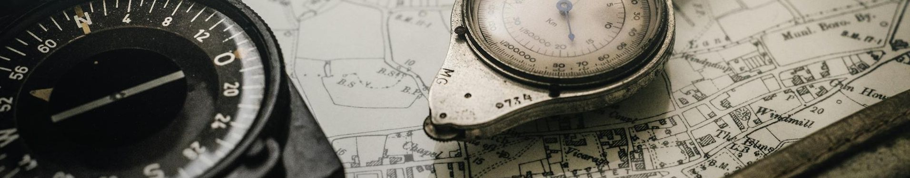
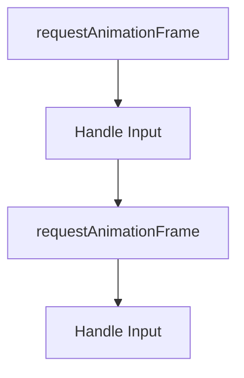
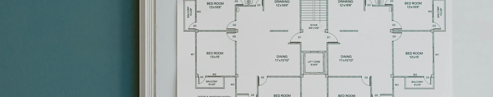
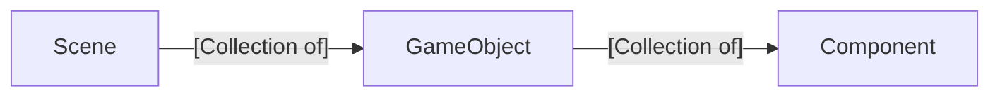

# Fall2025.Topics
These are the topics we are going to cover in class each day. Links to [example student videos ](https://www.youtube.com/playlist?list=PLH9qo0GKu2iSlchbSeksN18S87gMIjHOg) and [slides from class](https://uofnebraska-my.sharepoint.com/:f:/g/personal/17816140_nebraska_edu/EktuKJi3m_9Khf6sZLG_lrkBc46ZoPAOI6gCk86_xmf0sQ?e=sRqveC)

<br/><br/>
---
---


# Day 29 - December 10 - RectTransform and Letter Boxes (🧑‍🏫Lecture)

## 🖼️Activity: Find Letterboxing in games
- Clash Royale: https://www.youtube.com/watch?v=_hNxfiXmeAE
- See Zelda at 2:50 in this video: https://www.youtube.com/watch?v=_hNxfiXmeAE

## 💡New Idea: Letter boxes
- Letter boxes preserve the aspect ratio of your game 
- This means it appears the same across all screens

## 👩‍💻Code Together: Letterboxes
- Add a aspectRatio property to GameProperties
- Add aspectRatio, effectiveWidth, effectiveHeight, letterBoxSize, and letterBoxType to Engine
- Determine the kind of letter boxing required
- Offset the UI appropriately
- Draw the game
- Draw the letter boxes

## 💡New Idea: RectTransform
- Look at the layout in MS Word
- Look at Mario Kart 8 Deluxe: https://www.youtube.com/watch?v=SxeeuUh8R0Q
- Basic Anchors
- Basic Offset
- Rectangular Anchors
- Rectangular Offsets

## 👩‍💻Code Together: RectTransform
- Add RectTransform to UI game objects
- Update Transform getLocalTransform to handle rect transform
- Handle 

## 🏁Final Code
- [The final code for today](https://github.com/cs2510/Fall2025.Day29.RectTransform)


<!-- I didn't have time to really cover RectTransform. I felt like I needed a demo that showed how the different configurations worked. -->

<br/><br/>
---
---


# Day 28 - December 8 - (👟Sprint)
<br/><br/>
---
---


# Day 27 - December 3 - Particle Systems (🧑‍🏫Lecture)

## 💡New Idea: Juicing with Particle Systems
- Particle systems add "juice" to a game in two ways
  - Providing feedback that something happened. For example, that you swung your sword or that your sword hit something
  - Providing ambience. For example, the jets on a spaceship

## 🖼️Activity: Identify Particle Systems
- Look at a game. 
- Identify the use of particles systems 
- Identify if the particle systems are use for feedback or ambience

## 💡New Idea: Particle Systems
- Particle systems are components you add to a game object.
- Particle systems update and draw a large number of particles without each particle being treated as its own game object
- Particle Systems have a large number of parameters that are controlled with `distributions`.
  - Start/end size of particles
  - Start/end velocity of particles
  - Start/end color of particles
  - Start/end alpha of particles
  - Lifetime of particles
  - Number of particles created when the system starts
  - Number of particle created as time passes
  - and many more we didn't have time to discuss...

## 👩‍💻Code Together: Particle Systems
- Add a particle system component to the game engine
- Use the particle system to add explosions to the space shooter game

## 🏁Final Code
- [The final code for today](https://github.com/cs2510/Fall2025.Day25.ParticleSystems)


# Day 26 - December 1 - Pause and Time Scaling (👟Sprint)

## 💡New Idea: Pause
- There are two kinds of pausing in a game
- System level, where the whole game pauses. 
  - Consoles let you do this if you push the pause button on a controller.
  - You can achieve this by not calling update on any game objects in the scene. 
- Game controlled, where only part of the game pauses
  - You can achieve this with time scaling.

## 💡New Idea: Time scaling
- For advanced timing, we can adding a scaling option to our Time object
  - For example, if you want to pause the game while a menu is being shown, you would scale the time to 0.
  - As another example, you can scale time up if you want to make a level more difficult.

<br/><br/>
---
---


# Day 25 - November 24 - Events (👟Sprint)

## 💡New Idea: Events
- Events provide a way for us to [loosely-couple](https://en.wikipedia.org/wiki/Loose_coupling) components that need to communicate
- Setting up events requires three steps
  - Registering an event listener
  - Firing an event
  - Handling the event

## 👩‍💻Code Together: Events
- Change the interaction between the enemy component and the score so that it uses events
- Change the interaction between the button on the start scene so it is loosely coupled.

## 🖼️Activity: Identify events
- Review a game (for example Donkey Kong Bananza) and discuss where events and loose coupling could be used in the game

## 🏁Final Code
- [The final code for today](https://github.com/cs2510/Fall2025.Day25.Events)

<br/><br/>
---
---


# Day 24 - November 18 - Behavior Trees (🧑‍🏫Lecture)

## 🖼️Activity: Identify behaviors in a game
- Look at the behaviors of NPCs in [Silk Song](https://www.youtube.com/watch?v=myzGQsKgxfI). Perhaps start at 4:00
- How would you describe how you got to school today to a robot.

## 💡New Idea: Behavior Tree Nodes
- Simple, self-contained activities
- Designed to be composed
- Always return FAILURE, SUCCESS, or RUNNING

## 💡New Idea:➰Repeater Node 
- Repeats a node when it succeeds or fails
- A repeater node is a kind of decorator (changes the behavior of another node)
- Often denote with a loop symbol

## 💡New Idea: Composite Node
- Controls the flow of multiple nodes

## 💡New Idea➡️Sequence Node (Composite)
- Runs one task after another failure or all succeed
- A kind of inversion of a selector node
- Often denoted as an arrow or and sign

## 💡New Idea:❓Selector (Fallback) Node (Composite)
- Runs one task after another until success or all fail
- A kind of inversion of a sequence node
- Often denoted by a question mark or an or sign

## 💡New Idea:⏩Parallel Node (Composite)
- Run a foreground task until failure or success
- Repeat a background task until then
- Often denoted by a double arrow


## 👩‍💻Code Together: Behavior Trees
- Build a Behavior Tree together

## 🧭Ideas to explore on your own
- What other nodes would support games in general
- What AI can you implement as a behavior tree in your game

## 🏁Final Code
- [The final code for today](https://github.com/cs2510/Fall2025.Day24.BehaviorTrees)
<br/><br/>
---
---


# Day 23 - November 17 - Cookies (👟Sprint)

## 💡New Idea: We Can Store Information Across Scenes
- We can read a persistent cookie with `document.cookie`
- We can write a persistent cookie with `document.cookie`
- For cookies with more than one value, we can use json
  - See [`JSON.stringify`](https://developer.mozilla.org/en-US/docs/Web/JavaScript/Reference/Global_Objects/JSON/stringify) and [`JSON.parse`](https://developer.mozilla.org/en-US/docs/Web/JavaScript/Reference/Global_Objects/JSON/parse)

## 💡New Idea: We Can Store Information Across Scenes
- We can read external files with [`fetch`](https://developer.mozilla.org/en-US/docs/Web/API/Fetch_API)
  - `fetch` uses promises, [an asynchronous concept in javascript](https://developer.mozilla.org/en-US/docs/Web/JavaScript/Reference/Global_Objects/Promise) and many other languages.
- If we `fetch` a json file, we can use the data to populate our scenes
  - For example, [the Tiled open-source map editor](https://www.mapeditor.org/) can export in json.

## 🏁Final Code
- [The final code for Day 23](https://github.com/CS2510/Fall2025.Day23.Cookies)

Here's what changed in the code:
```diff
renamed Day20.html to Day23.html with the following changes:
 <html>
 <head>
-    <title>Day 20 Game</title>
+    <title>Galaxy Guardians Space Shooter Game</title>
     <style>
         *{
             margin: 0;

added file game/data.json

updated game/components/ScoreController.js
     score = 0
     update(){
         this.gameObject.getComponent(Text).text = "Score: " + this.score
-        if(GameGlobals.highScore < this.score)
+        if(GameGlobals.highScore < this.score){
             GameGlobals.highScore = this.score
+            document.cookie = GameGlobals.highScore
         }
     }
+}

updated game/components/StartSceneController.js
 class StartSceneController extends Component{
     start(){
         this.time = 0
+        //Example of how to use cookies to persist data across sessions
+        if(document.cookie){
+            const score = parseInt(document.cookie)
+            if(score > GameGlobals.highScore)
+                GameGlobals.highScore = score
         }
+        document.cookie = "" + GameGlobals.highScore
+        //Example of how to read data from an external file
+        fetch("./game/data.json")
+        .then(result=>result.json())
+        .then(json=>console.log(json))
+    }
     update(){
         this.time += Time.deltaTime
```


<br/><br/>
---
---


# Day 22 - November 12 - Class Canceled🤧

<br/><br/>
---
---


# Day 21 - November 21 - Time (👟Sprint)

## 💡New Idea: Adjusting time based on the actual frame rate
- We can get the elapsed time from `requestAnimationFrame` calls.
- By subtracting from the previous time stamp, we can get the correct value for `Time.deltaTime`
- You can force your game to run slower (to simulate a slower machine) in the performance tab of your browser.
## 🏁Final Code
- [The final code for today](https://github.com/CS2510/Fall2025.Day21-Timestamp)

Here's what changed in our code:
```diff
updated engine/Engine.js
     static ctx
     /**
+     * @type {number} The timestamp in milliseconds the last time we got a requestAnimationFrame callback
+     */
+    static lastTimestamp = performance.now()
+    /**
      * Start the game
      * @param {GameProperties} gameProperties Optional argument for specific game-specific properties
      */
...
         SceneManager.update()
         SceneManager.getActiveScene().start()
-        Engine.gameLoop()
+        requestAnimationFrame(Engine.gameLoop)
     }
     /**
      * Run the game loop. This update the various static classes, then updates the game objects and draw them.
      */
-    static gameLoop() {
+    static gameLoop(timestamp) {
+        //Update Time.deltaTime based on the timestamp
+        Time.deltaTime = (timestamp - Engine.lastTimestamp)/1000
+        Engine.lastTimestamp = timestamp
         SceneManager.update()
         Engine.update()
         Engine.draw()
```

<br/><br/>
---
---


# Day 20 - November 6 - Collision Layers, etc. (🧑‍🏫Lecture)

## 🖼️Activity: Why do we play games
- What motivates us to play games?
- How does a score affect our desired to play games?

## 💡New Idea: Scene to Scene Communication (Globals)
- We can store information across scenes with a global class
- All the global entries should be `static`
- These globals are an engine-level class

## 💡New Idea: Collisions Raycast
- There are times when we need to check for collisions between a point and collider, not just collider/collider
- `Collisions.raycast` takes a point and determines which game object the point is above.
- This is commonly used when determining what the mouse is hovering over

<!-- Look at Unity's OnMouseDown -->

## 💡New Idea: Collision Layers
- Not every pair of game objects with a collider needs to be checked for collisions.
- Collision layers allow us to speed up collision detection
- Collision layers allow us to prevent certain game objects from interacting that shouldn't be.
- To use collision layers, we need to add layers to differentiate what game objects can collide.
- Collision Layers are part of the `GameProperties` 
  
## 🖼️Activity: Look for collision layers
- Review a modern game, such as Hogwarts Legacy
- Can you guess what collision layers they are using?

## 💡New Idea: Text Alignment
- We can align text vertically and horizontally
  
## 💡New Idea: Cheat Codes
- We can dramatically speed up debugging if we add cheat codes
  - Ending a level
  - Becoming invincible

## 💡New Idea: Tags
- Currently we can search for game objects by name or filter by layer
- Tags give us another way to label game objects to make them easier to find. 
- Tags are member variables on the `GameObject` class.

## 💡New Idea: Time
- We spend a lot of time tracking time within our components. By expanding the `Time` class, we can simplify our code.
- `Time.time` tracks the time in seconds since the game started
- `Time.frames` tracks the number of frames since the game started
- In order to track this data, we need to update `Time` in our game loop


## 🧭Ideas to explore on your own
- What are other ways to organize your game objects?
- What are better ways to reduce the speed of collision detection?

## 🏁Final Code
- [The final code for today](https://github.com/cs2510/Fall2025.Day20-CollisionLayers)
- [A lot changed in the files for Day 20. You can see the differences here.](./diffs/Day18toDay20.md)
<br/><br/>
---
---


# Day 19 - November 3 - (👟Sprint)
<br/><br/>
---
---


# Day 18 - October 29 - Game Object Hierarchy (🧑‍🏫Lecture)

## 🖼️Activity: Game are built using hierarchies
- Look for game object hierarchies in [Mario Kart 64](https://www.youtube.com/watch?v=w8K-heSWX8s)
- Look how game object hierarchies are used in [Echoes of Wisdom](https://youtu.be/01onjjAUnOQ?si=_08wHwSa2sMCxuGz&t=123)
- Look how game object hierarchies are used in [Zero Company](https://www.youtube.com/watch?v=rcxnRaZ6slU)

## 💡New Idea: Game Object Can Have Child Game Objects
- This create powerful hierarchies
  - Allows for game objects to "hold" other game objects
  - Easy alignment of UI
  - Complex rotational movements

## 👩‍💻Code Together: Game Object Hierarchy
- Update Transform
  - setParent
  - getLocalMatrix
  - getGlobalMatrix
- Update GameObject draw
- Update Collisions
- Orbiting colliders
- Aligned Text

## 🧭Ideas to explore on your own
- How can you convert your game to use hierarchies?

## 🏁Final Code
- [The final code for today](https://github.com/cs2510/Fall2025.Day18.GameObjectHierarchy)
<br/><br/>
---
---


# Day 17 - October 27 - (👟Sprint)

## 💡New Idea: Delayed Scene Changes
- We don't want to change the scene in the middle of an update loop.
- Instead, we want to update the next time we start a frame in the game loop
- By tracking the next scene in SceneManager, we can wait to make the change at the appropriate time.

## 👩‍💻Code Together: Update the SceneManager Class
```diff
@@ -1,9 +1,16 @@
 class SceneManager{
     static currentScene
+    static nextScene
+    static update(){
+        if(SceneManager.nextScene){
+            SceneManager.currentScene = SceneManager.nextScene
+            SceneManager.nextScene = undefined
+        }
+    }
     static loadScene(scene){
-        SceneManager.currentScene = scene
+        SceneManager.nextScene = scene
     }
-    static getActiveScene(scene){
+    static getActiveScene(){
         return SceneManager.currentScene
     }
 }
```

## 🏁Final Code
- [The final code for today](https://github.com/cs2510/Fall2025.Day17.Scenes2)


<br/><br/>
---
---


# Day 16 - October 22 - Scenes and the Scene Manager, etc.(🧑‍🏫Lecture)

## 🖼️Activity: Spaces
- Review a game that uses mouse input (DOTA 2?). 
- How does the mouse input get translated to positions in the world for characters to respond to?

## 💡New Idea: Moving backward through spaces
- Rendering moves us from model space toward screen space
- Input needs to move backward from screen space toward model space
  - 🛝See slides on Spaces

## 👩‍💻Code Together: Moving from screen space to world space
- Reproduce the transforms done to move from camera space to screen space in a DOMMatrix
- Take the screen point and convert it to a DOMPoint
- Multiply the inverse of the DOMMatrix by the DOMPoint. 
  - The resulting point is in world space

## 💡New Idea: Assets
- Some polygon points are used over and over. 
- By putting them in an assets class, we can simplify their use.

## 🖼️Activity: Multiple Scenes
- Review a game that has many scenes (Mario 3?)
- How do games use scenes to communicate what is needed from the user?
- How do games use scenes to communicate the feel of the story presented?

## 💡New Idea: SceneManager
- To help us transition between scenes, we will use a SceneManager class
   - 🛝See slides on Standard Game Engine Hierarchy

## 👩‍💻Code Together: SceneManager
- Add a SceneManager class to the engine.
- Remove references to Engine.currentScene
- Change our space shooter game so it has multiple scenes
- Explore ways to transition between scenes
  - Time
  - Input
  - Button click

## 🧭Ideas to explore on your own
- What other times are there when you need to move backward through spaces?
- How do you have screen points in 3D worlds?

## 🏁Final Code
- [The final code for today](https://github.com/cs2510/Fall2025.Day16.Scenes)
<br/><br/>
---
---


# Day 15 - October 15 - Cameras (🧑‍🏫Lecture)

## 🔙Review
- Round trip with polar coordinates


## 💡New Idea: Games need a camera
- Camera Game Object
- Camera Component
- Camera.main
- Centering a camera
- Moving a camera
 

## 👩‍💻Code Together:
- Add a camera game object to a game
- Add a camera component to that game object
- Move the camera with another game object


## 💡New Idea: Layers
- Default Layer
- UI Layer
- Setting Layers in the Game Object constructor


## 🖼️Activity:
- Look at layers in this clip of [Brawl Stars](https://www.youtube.com/watch?v=F_WaKZJ9B-0)
- What list of layers would you have in this game?


## 💡New Idea: Game-specific Properties
- Each game has properties that don't belong in a specific scene, game object, or component
- These include the layers the game will use

## 👩‍💻Code Together:
- Add new layers from the game properties
- Assign game objects to layers
- Demonstrate that background game objects are behind foreground objects


## 🧭Ideas to explore on your own
- When would a game have multiple cameras?
- How would you implement multiple cameras in a game?

## 🏁Final Code
- [The final code for today](https://github.com/cs2510/Fall2025.Day15.Cameras)
<br/><br/>
---
---


# Day 14 - October 13 - Rotations in Collisions (👟Sprint)

## 💡New Idea: Rotations in Collisions
- We can rotate our polygons, but we aren't accounting for that in our collisions
- If we rotate the polygon points before we do our collisions calculations, everything will line up
- You can rotate a vector by
  - Finding the current angle using the arctangent
  - Adding the rotation
  - Calculating the x and y coordinates using the sine and cosine functions
- Never use `atan()`. The function is buggy. Always use `atan2()`.
  
<br/><br/>
---
---


# Day 13 - October 8 - Mouse Input, etc. (🧑‍🏫Lecture)

## 💡New Idea: Show Text
- Explore the `fillText` function
  - Additional information available at https://developer.mozilla.org/en-US/docs/Web/API/CanvasRenderingContext2D/fillText and https://www.w3schools.com/jsref/canvas_filltext.asp
  - 🛝See slides on fonts

## 👩‍💻Activity: Add Score Text to the Space Shooter Game
- We can add text to the screen now...
- ... but we don't have a way to update it, unless we can communicate between game objects...

## 💡New Idea: Component/Component Communication
- Use when two components on the same game object need to communicate
  - If the component you need is a transform, use `this.transform`
  - If you need another component, use `this.gameObject.getComponent(type)`

## 💡New Idea: Game Object/Game Object Communication
- Use when two components in the same scene but different game objects need to communicate
  - `GameObject.find("Name").transform` or `GameObject.find("Name").getComponent(type)`

## 👩‍💻Activity: Update Score Text from Another Game Object
- When a laser destroys an enemy, find the score game object and update its score controller's score variable.

## 💡New Idea: Tracking the mouse
- Mouse events
  - 🛝See slides on Input
  - mousemove
    - 🔗Additional information at https://developer.mozilla.org/en-US/docs/Web/API/Element/mousemove_event
  - mousedown
    - 🔗Additional information at https://developer.mozilla.org/en-US/docs/Web/API/Element/mousedown_event
  - mouseup
    - 🔗Additional information at https://developer.mozilla.org/en-US/docs/Web/API/Element/mouseup_event
- What is the order of the buttons on a mouse?

## 👩‍💻Activity: Create a Whack-a-Mole Game
- Create a small polygon that tracks the mouse
- The the mouse polygon overlaps the "mole", update the score
- Update the score by finding the score game object (`GameObject.find()`) and then getting the score controller (`.getComponent(ScoreController`).
- Unfortunately, we score points for every frame that we are holding the mouse down. 
  - We need a way to know when the mouse button went down and when it came up.

## 💡New Idea: Input This Frame
- We really want to the user to have access to three things:
  - When a button went down the first time
  - When the button is down
  - When the button goes up
- By creating new arrays that store when buttons go down and up, we can achieve this
  - We need to clear these arrays each frame.

## 👩‍💻Activity: Fix the Whack-a-Mole Game
- Update the `onCollisionEnter` function so that it only adds points when the button goes down, is held, or is released.
- This demonstrates the three events we want the user to have access to

## 💡New Idea: Rotation
- We have a rotation variable in our transform, but we never use it.
- Adding rotation to the `Polygon` component is complex and it is impossible for our new `Text` component.
- We can use the built-in transform functions on our context
  - `translate` moves items. See [API for translate](https://developer.mozilla.org/en-US/docs/Web/API/CanvasRenderingContext2D/translate)
  - `scale` scales items. See [API for scale](https://developer.mozilla.org/en-US/docs/Web/API/CanvasRenderingContext2D/scale)
  - `rotate` rotates items. See [API for rotate](https://developer.mozilla.org/en-US/docs/Web/API/CanvasRenderingContext2D/rotate)
- We must clear changes we make so that they don't propagate to other draw calls
  - We clear changes by calling `save` and `restore`. See [API for save](https://developer.mozilla.org/en-US/docs/Web/API/CanvasRenderingContext2D/save) and [API for restore](https://developer.mozilla.org/en-US/docs/Web/API/CanvasRenderingContext2D/restore)


## 🧭Ideas to explore on your own
- HTML has support for gamepads if one is plugged in. You can explore this if it is your preferred method of input.
- Should games always follow the exact laws of physics? If not, how should you communicate to your player that the rules are different?

## [🏁Final Code](https://github.com/cs2510/Fall2025.Day13.MouseInput)
<br/><br/>
---
---

# Day 12 - October 6 - Platformers (👟Sprint)

## Ideas for Platformers
- Be creative. Maybe you can grab the side of walls like in the original [NES Batman Game](https://www.youtube.com/watch?v=jMwksWSsfW4)
- Fix a [bug in our collision code](https://github.com/CS2510/Fall2025.Day11.Gravity/blob/c7d44cf8bdfd83d5321bb389ef239d3dd6fbb836/platformer.html#L87)
- Talk about making movement feel natural by accelerating in x and adding a terminal velocity in y.
<br/><br/>
---
---


# Day 11 - October 1 - RigidBody and  Collision Resolution (🧑‍🏫Lecture)

## 💡New Idea: Collision Detection Implementation
- Previously we implemented the separate axis theorem
- Update the game engine so it checks for collisions as part of the game loop
- When there is an overlap, call `onCollisionEnter` for both game objects

## 👩‍💻Activity: Add Collision Detection to our Space Shooter
- Add `onCollisionEnter` to our enemy ships
- Check to see if the colliding object is a laser

## 💡New Idea: Physics
- Newton's three laws of motion can be added to our game engine with:
  - A RigidBody component (laws 1 and 2: inertia and forces)
  - Collision Resolution (law 3: equal and opposite reaction)

## 💡New Idea: RigidBody
- The RigidBody component is a special component that tracks a game object's velocity and acceleration
- We use this component to also track gravity
- Every update, acceleration updates velocity
- Every update, velocity updates position

## 👩‍💻Activity: Code a falling game object with gravity
- Add a RigidBody component to a game object 
- Set gravity
- Watch the simulation

## 💡New Idea: Collision Resolution
- When two game objects overlap, we should move them following Newton's third law
- The separate axis theorem can help us find the minimum transform vector (MTV)
- We find the axis with the lowest overlap. 
  - This axis shows us the direction and distance we need to move to resolve a collision

## 👩‍💻Activity: Add Collision Resolution to a Platformer Game
- By adding collision resolution to a platformer, our character no longer falls through platforms
- By checking the objects we are in collision with, we can determine if we can jump.


## [🏁Final Code](https://github.com/cs2510/Fall2025.Day11.Gravity)
<br/><br/>
---
---


# Day 10 - September 29 - 👟Sprint
<br/><br/>
---
---


# Day 09 - September 24 - Collisions  (🧑‍🏫Lecture)

## ~~📢Announcements~~n

## 🔙Review
- Fix `start` code from before
- Reminder to only use the `Polygon` component, not rectangles or circles

## 💡New Idea: Orthogonal Vectors
- Two vectors are orthogonal if their dot product is 0. 
- This is the same as having a 90 degree angle between them
- In 2D, the vector (x,y) is orthogonal to (-y, x) and (y, -x)
- 
## 💡New Idea: Collider Components
- We use collider components to identify which game objects need to have collision detection done
- In this course the collider component is empty
- In commerical game engines, a collider may provide a simplified version of a polygon to speed up collisions

## 👩‍💻Activity: Code the Separate Axis Theorem
- Are there any games that don't have any collisions?
  - Word games like hangman or Wordle
  - Text-based adventures
- Almost all games do, especially if there any any buttons to push anywhere.

## 💡New Idea: Separate Axis Theorem
- Two convert polygons are not in collision if you can draw a straight line (axis) between them
- If there is a line where the projections of the two polygons don't overlap, then the are not in collision
- We only need to check a finite number of lines:
  - The lines who tangents are orthogonal to each pair of points in the polygons
- This algorithm does not work for concave polygons

## 👩‍💻Activity: Code the Separate Axis Theorem


## 🧭Ideas to explore on your own
- How could we use the separate axis theorem on concave objects?
- How could we speed up the separate axis theorem?


## 🏁Final Code
 - [The final code for today](https://github.com/cs2510/Fall2025.Day09.Collisions)
<br/><br/>
---
---

# Day 07 - September 22 - 👟Sprint
<br/><br/>
---
---

# Day 07 - September 17 - Collisions Prep (🧑‍🏫Lecture)

## ~~📢Announcements~~


## 🔙Review
- Think about a scene made out of Lego bricks
  - What is similar to a component? (The individual Lego bricks)
  - What is similar to a scene? (The placement of the individual models.)
  - What is similar to a game object? (The models made out of individual components.)

| Scene| Game Object | Components|
|---|---|---|
| A collection of game objects with their position and rotation | A collection of components with a scale| The fundamental game-specific code|
| Everything defined in the constructor | Everything defined in the constructor| Nothing in the constructor, use `start`, `update`, and `draw`.|


## 💡New Idea: Defining Polygons with Points
- We don't want to have to create a new component each time we want a polygon of a different shape. If we add a `points` variable to our `Polygon` component, we can loop over those points when we draw. We can also update the points in the `Polygon` in the constructor of a game object, customizing it for each game object.

## 👩‍💻Activity: Using `Polygon` for different shapes
- Take our space shooter game and change the shape of the objects while using the same `Polygon` component.

## 💡New Idea: Vector Multiplication

$$ v\ times\ s = (v_{x}*s, v_{y}*s)$$
$$ v_1\ scale\ v_2=(v_{1x}*v_{2x}, v_{1y}*v_{2y})$$
$$ v_1\ dot\ v_2=v_{1x}*v_{2x}+v_{1y}*v_{2y}$$

- We use `times` when we want to scale a vector by a single number (a scalar). For example, if I want to make a polygon twice as large in all directions, I would multiply each point in the polygon by one number using `times`
- We use `scale` when we want to scale a vector by another, non-uniform vector. For example,  if I want to make a square a rectangle, I would multiple each point in the square by a non-uniform vector using `scale`. The `scale` function is similar to the mathematical idea of component-wise multiplication.
- We use `dot` when we need to find the similarity between two vectors or project one vector onto another vector. For example, if I want to know if the heading of an enemy is nearly the same direction as the heading toward the player, I would multiple those two vectors using `dot`. As another example, if I want to project vector 1 on vector 2, I would multiple those two vectors using `dot`.
  - When two vectors have an identical heading, their dot product is 1. If there are orthogonal, their dot product is 0. If they are pointing in opposite directions, then the dot product will be -1.
  - Additional information can be found here: https://en.wikipedia.org/wiki/Dot_product

## 👩‍💻Activity: Multiply the movement of objects by a speed
- Use `times` to make objects move further or shorter every frame.
- Use a boolean value to let a space ship fire on alternating sides.

  

## 💡New Idea: Removing game objects
- Destroy a game object by marking it for delete
- We don't immediately destroy game objects to prevent race conditions
   - 🛝See slides on Deleting Objects

## 👩‍💻Activity: Remove lasers when they are off screen
- To prevent the game from overloading, we can remove lasers when they are off the screen.

## 💡New Idea: Setting up frame-rate independent behavior
- Anytime we move anything, we should multiply by `Time.deltaTime`. If `Time.deltaTime` is updated based on the time between frames, then the behavior of the game should be independent of the speed of the machine.

## 👩‍💻Activity: Multiply all movement by `Time.deltaTime`
- This allows us to define all motion in terms of pixels/second.
- When we add a camera, we can move to feet/second or meters/second.


## 💡New Idea: Named Game Objects
- In order to find game objects in a scene, we give each game object a name.
  - [To see more about how `name` is used in Unity, you can review the documentation here](https://docs.unity3d.com/6000.2/Documentation/ScriptReference/Object-name.html)

## 🏁Final Code
 - [The final code for today](https://github.com/CS2510/Fall2025.Day07.CollisionsPrep)
<br/><br/>
---
---

# Day 06, September 15 - Engine Class, Instantiate (👟Sprint)

## 🔙Review
- Time outside of class means times in front of the keyboard coding
- Working inside another engine does not count toward this class

## 👩‍💻Activity:
- Move the code in our html file into a new Engine class
- Call instantiate to create new game objects as needed
  - 🛝See slides on Starting Objects

## 🏁Final Code
 - [The final code for today](https://github.com/CS2510/Fall2025.Day06.EngineClass)
<br/><br/>
---
---


# Day 05, September 10 - Transforms (🧑‍🏫Lecture)

## 📢Announcements
- Upcoming sprint
  - Study an existing game (write down what you learn)
  - Follow a JS tutorial
  - Start working on your own game
  
## 👩‍💻Activity: Talk about what you are doing/will do during your sprint
- If you don't know, talk to the professor

## 🔙Review
- Fix movement bug from Day 04 (use getters in Vector2)
  - 🔗Additional information available at https://developer.mozilla.org/en-US/docs/Web/JavaScript/Reference/Functions/get and https://www.w3schools.com/js/js_object_accessors.asp

## 💡New Idea: Components track their parent game object
- When we add components to a game object, we need to track which game object is their parent
- Components have a `gameObject` field
  - 🔗Additional information available at https://docs.unity3d.com/6000.2/Documentation/ScriptReference/Component-gameObject.html
- Game objects add components through a `addComponent` function
- We pass a reference to a component's class instead of using an new instance of the class


## 💡New Idea: Transforms
- All game objects have a position, rotation, and scale
  - 🔗Additional information available at https://docs.unity3d.com/6000.2/Documentation/ScriptReference/Transform.html
- Add a transform component in the game object constructor
- Use getters to easily access the transform from components
  - 🔗Additional information available at https://docs.unity3d.com/6000.2/Documentation/ScriptReference/Component-transform.html
- Use the transform when rendering

## 💡New Idea: Instantiate in scenes
- We set the position and rotation of game objects in scenes
- We add game objects using a custom `instantiate` function
- We don't set the transform in a component's `start`

## 💡New Idea: Draw Polygons in an Engine-Level Component
- So many game objects need to be drawn, we don't need to keep repeating drawing code
- Add a new `Polygon` component to the engine folder
- This component draws based on the transform (including scale) and a set of points

## 💡New Idea: Set values in `addComponent`
- We want to set custom values on components in game objects
- This supports reusability
- We will use JS's `Object.assign` function
  - 🔗Additional information available at https://developer.mozilla.org/en-US/docs/Web/JavaScript/Reference/Global_Objects/Object/assign and https://www.w3schools.com/jsref/jsref_object_assign.asp


## 👩‍💻Activity: Reusing components
- Watch a game
- Think about which components can be reused among the game objects.


## 🤔To Think About
- What scenes, game objects, and components will you need in your game?

## 🏁Final Code
- [The final code from Day05](https://github.com/CS2510/Fall2025.Day05.Transforms)


<br/><br/>
---
---

# Day 04, September 8 - Keyboard Input (🧑‍🏫Lecture)

## 📢Announcements
- First self-assessment/quiz in 7 days
- We will be "on the clock" this week.
- Copy v transcribe (review AI)

## 🔙Review
- What is a Scene v Game Object v Component

## 👩‍💻Activity: Code on your own -> Add a new game object
- Add an additional triangle to the Day 03 code using Game Objects and Components
- 🔗[Detailed instructions here](https://github.com/CS2510/Fall2025.Day04.Input/blob/main/TODO.md)

## 💡New Idea: Keyboard Input
- How is input handled by the computer?

- How can we capture keyboard changes?
- 🛝See slides on Input

## 👩‍💻Activity: Keyboard Input
- Move a game object on the screen based on keyboard input
- See final code

## 🤔To Think About
- Why do many games use a combination of inputs, e.g. mouse and keyboard instead of just keyboard or mouse?

## 🏁Final Code
- [The final code from Day04](https://github.com/CS2510/Fall2025.Day04.Input)

<br/><br/>
---
---

# Day 03, September 3 - Standard Architecture for Games (🧑‍🏫Lecture)

## 📢Announcements
- None

## 🔙Review
- What is a game loop?
- What is a vector?


## 💡New Idea: Engine-specific v Game Specific
- Look at a game. For example, look at a classic [Nintendo game](https://www.retrogames.cz/play_004-Atari2600.php)
  - What parts of the game would be in all or most games? These would be engine-specific
  - What parts of the game are very specific to this game? These would be game-specific
- By separating our code into engine-specific and game-specific code, we start to create an engine. This makes it easier to create games and prepares us to use a commerical game engine.  

## 👩‍💻Activity
- Go through the Day03 code and label the code as being engine-specific or game-specific

## 💡New Idea: Three main functions of "things" in a game
  - Start
  - Update
  - Draw

## 💡New Idea: Main Game Architectural Hierarchy
- Scenes (also levels or stages)
  - A scene is a collection of game objects
- Game Objects (also actors or pawns or entities)
  - A game object is a collection of components
- Components (also scripts)




## 👩‍💻Activity
- Create the files for engine-specific classes
  - Scene
  - GameObject
  - Component
- Add the start, update, and draw functions to each engine-specific class

## 👩‍💻Activity
- Create the files for game-specific classes
  - MainScene
  - TriangleGameObject
  - TriangleController
- Add the constructor, start, update, and draw functions to each game-specific class
- Rewrite the code so that the html code uses these new classes (see Final code section below).

## 🤔To Think About
- Can you add a second kind triangle that has a random velocity and is colored red using this architecture?

## 🏁Final Code
- This is the link for [the final code we generated on Day03](https://github.com/CS2510/Fall2025.Day03.GameEngine)
- 🔗You can see two other example games using the same architecture in the [other games Day03 repository](https://github.com/CS2510/Fall2025.Day03.OtherExamples)

<br/><br/>
---
---


# Day 02, August 27 - Game Loop (🧑‍🏫Lecture)
## 📢Announcements
- No class on Monday due to Labor Day

## 🔙Review
- What is the difference between the Box Model, SVG, and Canvas?
- What is the difference between the JS keyword `let` and `const`?

## Syllabus

## 💡New Idea: What is a computer game?
- In this class, a game is an enjoyable, interactive, visual simulation.
- How are we going to learn game programming?
  - Learn the math
  - Learn the architecture
  - Practice

## 💡New Idea: Repeated rendering (Visual)
- requestAnimationFrame
  - 🔗Additional information at https://developer.mozilla.org/en-US/docs/Web/API/Window/requestAnimationFrame, https://www.w3schools.com/jsref/met_win_requestanimationframe.asp

## 💡New Idea: Updating our game (Interactive)
- MVC (Architecture)
- gameLoop formalization (Architecture)
  - 🔗Additional information at https://m-abdullah-ramees0916.medium.com/the-game-loop-f6f5cb68c00, 


## 💡New Idea: Vectors (Math)
- What is a vector
  - 🔗Additional information at https://en.wikipedia.org/wiki/Vector_(mathematics_and_physics)
- Adding Vectors
  - 🔗Additional information at https://mathworld.wolfram.com/VectorAddition.html

## 💡New Idea: Physics (Math/Simulation)
- Velocity
  - 🔗Additional information https://en.wikipedia.org/wiki/Velocity


## 💡New Idea: Classes in JS
- classes in JS
  - 🔗Additional information at https://developer.mozilla.org/en-US/docs/Web/JavaScript/Reference/Classes, https://www.w3schools.com/js/js_classes.asp
- constructors in JS
  - 🔗Additional information at https://developer.mozilla.org/en-US/docs/Web/JavaScript/Reference/Classes/constructor, https://www.w3schools.com/jsref/jsref_constructor_class.asp
- class functions in JS
- field in JS
  - 🔗Additional information at https://developer.mozilla.org/en-US/docs/Web/JavaScript/Reference/Classes/Public_class_fields

## 👩‍💻Activity
- Create a simple bouncing triangle simulation using a new Vector2 class. (See Final Code section.)


## 🤔To Think About
- Why is creative mode in Minecraft considered a game while a painting app is not?

## 🏁Final Code
- Combining classes, vectors, and our original code, we arrive at our [Day 02 Code](https://github.com/CS2510/Fall2025.Day02.GameLoop).

## Ideas to explore on your own
- Can you change the code to make all the vertices of the triangle to have their own independent velocity?
  - Can you make the above change using arrays so that you don't need new variables for each vertex?

<br/><br/>
---
---

# Day 01, August 25th - Introduction (🧑‍🏫Lecture)

## 📢Announcements
- Welcome to class

## 🔙Review
- None
  
## 💡New Idea: Macro view of methods of drawing 

- Box Model
    - 
    - 🔗Addition information at https://www.w3schools.com/css/css_boxmodel.asp, https://developer.mozilla.org/en-US/docs/Learn_web_development/Core/Styling_basics/Box_model
- SVG
    - 🔗Additional information at https://developer.mozilla.org/en-US/docs/Web/SVG/Guides/SVG_in_HTML, https://www.w3schools.com/graphics/svg_intro.asp
- Canvas
    - 🔗Additional information at https://www.w3schools.com/html/html5_canvas.asp, https://developer.mozilla.org/en-US/docs/Web/API/Canvas_API

## What we won't be doing in class
- Images (Including emoji)
- Sounds

## 💡New Idea: New JS concepts

- Structure of an HTML document
  - doctype
  - html
  - head
  - body
  - script
  - Example code at https://github.com/CS2510/Fall2025.Day01.Introduction/blob/main/00_html_structure.html
  - 🔗Additional information at https://www.w3schools.com/html/html_intro.asp

- Access elements in JS
  - 🔗Additional information at https://www.w3schools.com/jsref/met_document_queryselector.asp

- Declaring variables in JS
  - let and const
  - Example code in [this file](./JS.html)
  - 🔗Additional information at https://www.geeksforgeeks.org/javascript/difference-between-var-let-and-const-keywords-in-javascript/

- Good Introductionary Websites in JS
  - w3schools JS tutorials at https://www.w3schools.com/js/
  - GeeksforGeeks JS tutorials at https://www.geeksforgeeks.org/javascript/javascript-tutorial/

## 💡New Idea: Methods of drawing specific to canvas
- Showing color
  - See slides: 3 Ways to show Color
  - 🔗Additional information about named colors at https://www.w3schools.com/html/html_colors.asp
  - 🔗Additional information about rgb and hexadecimal values at https://htmlcolorcodes.com/color-picker/
- Paths
  - 🔗Additional information at https://www.w3resource.com/html5-canvas/html5-canvas-path.php
- Polygons
- Rectangles
- Arcs
    - Introduction to radians
- Text
  - See slides: Fonts
  - 🔗Additional information at https://developer.mozilla.org/en-US/docs/Web/API/Canvas_API/Tutorial/Drawing_text, https://www.w3schools.com/graphics/canvas_text.asp
- Example code at https://github.com/CS2510/Fall2025.Day01.Introduction/blob/main/01_basic_drawing.html


## 👩‍💻Activity
- Take what we have learned about drawing and draw something more advanced.
- 
- [Batman Logos](https://flowingdata.com/2012/12/24/evolution-of-batman-logo-1940-2012/)

## 🤔To Think About
- Block out a game you enjoy using the basic drawing tools we use in class

## 🏁Final Code
- Example code at https://github.com/CS2510/Fall2025.Day01.Introduction/blob/main/02_blocking_a_game.html, https://github.com/CS2510/Fall2025.Day01.Introduction/blob/main/03_blocking_a_game_2.html

